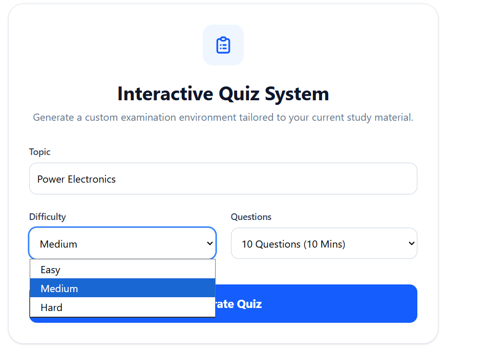
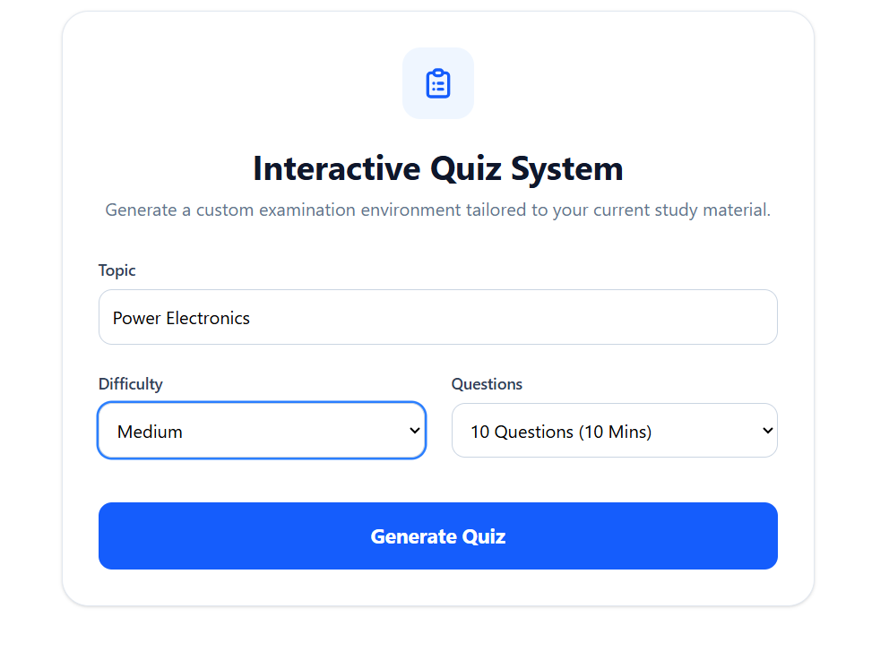
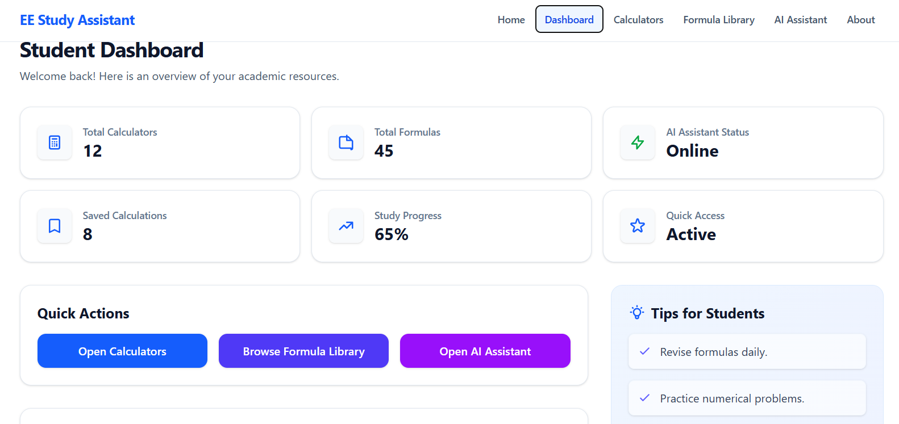
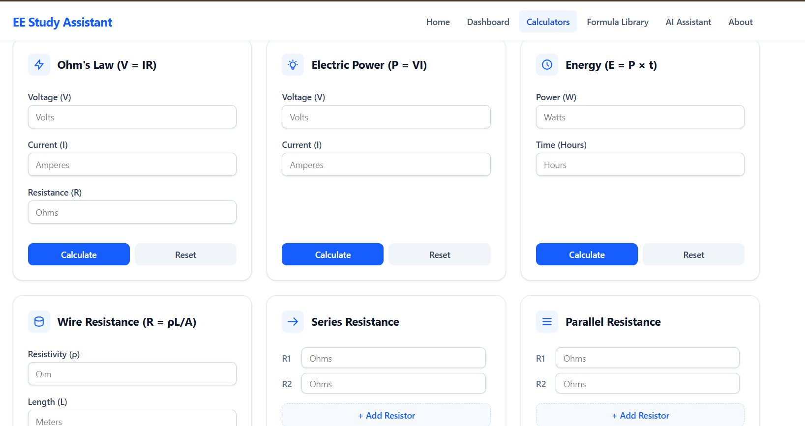

# EE-Study-Assistant ⚡

**Developed by:** Muhammad Qasim Raza  
**Institution:** University of Gujrat, Main Hafiz Hayat Campus  
**Roll Number:** 23013122-009  
**Degree:** BSc Electrical Engineering (6th Semester)

---

## 1. Overview & Problem Statement
* **App Name:** EE-Study-Assistant
* **What it does:** An all-in-one intelligent web-based academic companion and diagnostic dashboard tailored specifically for undergraduate electrical engineering students. It centralizes conceptual testing, formula references, and complex calculations.
* **The Real Problem:** Core electrical engineering subjects (such as Power Electronics, Control Systems, and Electromagnetics) involve rigorous mathematical frameworks. Students often lack a unified platform that combines a continuous, self-paced testing environment with instant diagnostic feedback, alongside essential reference tools like interactive calculators and formula libraries. This fragmentation disrupts the learning flow before major university examinations.

## 2. Live Application
* **Live Deployed URL:** [https://ee-study-assistant.vercel.app](https://ee-study-assistant.vercel.app) *(Click to launch)*

## 3. Features List
* **AI Quiz Generator:** Dynamically generates unique, undergraduate-level multiple-choice questions based on custom topics and difficulty levels.
* **Interactive Question Palette:** Allows users to jump between questions freely, track answered versus unanswered items, and monitor completion status.
* **Live Countdown Timer:** Enforces examination discipline with a visual countdown and auto-submission upon expiration.
* **Diagnostic Performance Breakdown:** Automatically computes final scores, performance tiers, and groups tested concepts into clear **Strengths** and **Topics Needing Revision**.
* **Detailed Review Mode:** Provides step-by-step explanatory breakdowns for every question, highlighting correct answers and explaining why incorrect options fail.
* **Interactive Electrical Calculators:** Instant computations for core circuit analysis and mathematical operations (e.g., Ohm's Law, Power).
* **Searchable Formula Library:** A categorized, easily accessible database containing over 40 critical electrical engineering formulas and equations.

## 4. AI-Powered Feature & System Prompt
* **AI Feature:** Powered by the Gemini API via a smart model-discovery loop that fetches undergraduate-level technical multiple-choice questions along with detailed mathematical and conceptual explanations.
* **System Prompt:**
  > You are an expert Electrical Engineering professor. 
  > Generate ONLY undergraduate-level Electrical Engineering MCQs.
  > Topic: [Dynamic Topic]. Difficulty: [Easy/Medium/Hard]. Number of questions: [Count].
  > Generate unique questions every time. Never repeat questions. Randomize option order.
  > Return ONLY a valid JSON array. Do NOT include markdown formatting, backticks, or code blocks.
  > Format strictly as an array of objects containing question, options, correctAnswer index, explanation, and concept tag.

## 5. Tools, Services, & Tech Stack
* **Frontend Framework:** React, Vite, TypeScript
* **Styling:** Tailwind CSS (v4)
* **AI Integration:** Google Gemini API (`@google/genai` standards via direct REST endpoints)
* **Version Control:** GitHub & GitHub Desktop
* **Hosting & Deployment:** Vercel

## 6. Screenshots
*(Note to Grader: Images are stored in the repository)*
1. **Setup View:**  
   
2. **Quiz Interface:**  
   
3. **Results Dashboard:**  
   
4. **Calculators & Formula Library:**  
   

## 7. How to Run Locally
To run this project on your local machine, follow these steps:

1. **Clone the Repository:**
   ```bash
   git clone [https://github.com/Qasim690/EE-Study-Assistant.git](https://github.com/Qasim690/EE-Study-Assistant.git)
   cd EE-Study-Assistant